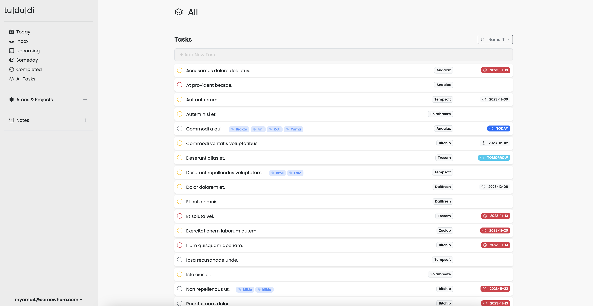
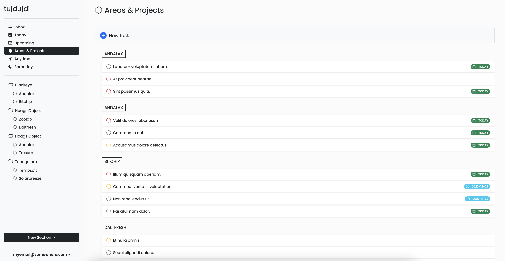

# tu | du | di

`tu|du|di` is a task and project management web application built with Sinatra. It allows users to efficiently manage their tasks and projects, categorize them into different areas, and track due dates. `tu|du|di` is designed to be intuitive and easy to use, providing a seamless experience for personal productivity.




## Features

- **Task Management**: Create, update, and delete tasks. Mark tasks as completed and view them by different filters (Today, Upcoming, Someday). Order them by Name, Due date, Date created or Priority.
- **Quick Notes**: Create, update, delete or assign text notes to projects.
- **Tags**: Create tags for tasks and notes. 
- **Project Tracking**: Organize tasks into projects. Each project can contain multiple tasks and/or multiple notes.
- **Area Categorization**: Group projects into areas for better organization and focus.
- **Due Date Tracking**: Set due dates for tasks and view them based on due date categories.
- **Responsive Design (in progress)**: Accessible from various devices, ensuring a consistent experience across desktops, tablets, and mobile phones.

## Getting Started

### Prerequisites

Before you begin, ensure you have met the following requirements:
- Ruby (version 3.2.2 or higher)
- Sinatra
- SQLite3
- Puma

### Installation

To install `tu|du|di`, follow these steps:

1. Clone the repository:
   ```bash
   git clone https://github.com/chrisvel/tududi.git
   ```
2. Navigate to the project directory:
   ```bash
   cd tududi
   ```
3. Install the required gems:
   ```bash
   bundle install
   ```

#### SSL setup

1. Create and enter the directory:
   ```bash
   mkdir certs
   ```

2. Navigate to the certs directory:
   ```bash
   cd certs
   ```

2. Create the key and cert:
   ```bash
   openssl genrsa -out server.key 2048
   openssl req -new -x509 -key server.key -out server.crt -days 365
   ```

### DB setup
1. Execute the migrations

    ```bash 
    rake db:migrate 
    ```

### Create your user
1. Open console
   ```bash
   rake console
   ```

2. Add the user
   ```ruby
   User.create(email: "myemail@somewhere.com", password: "awes0meHax0Rp4ssword")
   ```

### Usage

To start the application, run the following command in your terminal:

```bash
puma -C app/config/puma.rb
```

### Docker 

Pull the latest image:

```bash
docker pull chrisvel/tududi:0.14
```

In order to start the docker container you need 3 enviromental variables:

```bash
TUDUDI_USER_EMAIL
TUDUDI_USER_PASSWORD
TUDUDI_SESSION_SECRET
```

**PLEASE NOTE:** I am generating a new SSL certificate inside the Dockerfile. There will be an option to create and link an externally generated one in the future - at this stage I am doing this for simplicity.

1. Create a random session secret and copy the hash to use it as a `TUDUDI_SESSION_SECRET`:
    ```bash
    openssl rand -hex 64
    ```

2. Run the docker command with your produced hash at the previous step:
    ```bash
    docker run \
    -e TUDUDI_USER_EMAIL=myemail@example.com \
    -e TUDUDI_USER_PASSWORD=mysecurepassword \
    -e TUDUDI_SESSION_SECRET=3337c138d17ac7acefa412e5db0d7ef6540905b198cc28c5bf0d11e48807a71bdfe48d82ed0a0a6eb667c937cbdd1db3e1e6073b3148bff37f73cc6398a39671 \
    -v ~/tududi_db:/usr/src/app/tududi_db \
    -p 9292:9292 \
    -d chrisvel/tududi:0.14
    ```

3. Navigate to https://localhost:9292 and fill in your email and password.
4. Enjoy

### Testing 

To run tests:

```bash 
bundle exec ruby -Itest test/test_app.rb
```

Open your browser and navigate to `http://localhost:9292` to access the application and login with the email and the password you created.

## Contributing

Contributions to `tu|du|di` are welcome. To contribute:

1. Fork the repository.
2. Create a new branch (`git checkout -b feature/AmazingFeature`).
3. Make your changes.
4. Commit your changes (`git commit -m 'Add some AmazingFeature'`).
5. Push to the branch (`git push origin feature/AmazingFeature`).
6. Open a pull request.

## License

This project is licensed under the [MIT License](LICENSE).

## Contact

If you have any questions or comments about `tu|du|di`, please feel free to [open an issue](https://github.com/chrisvel/tududi/issues) or contact the developer directly.

---

README created by [Chris Veleris](https://github.com/chrisvel) for `tu|du|di`.
