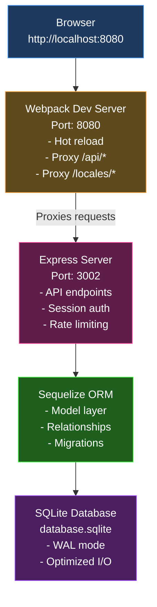
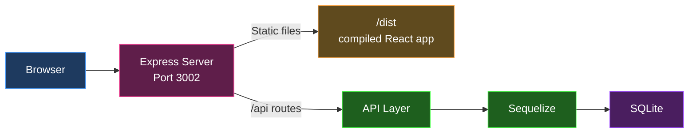
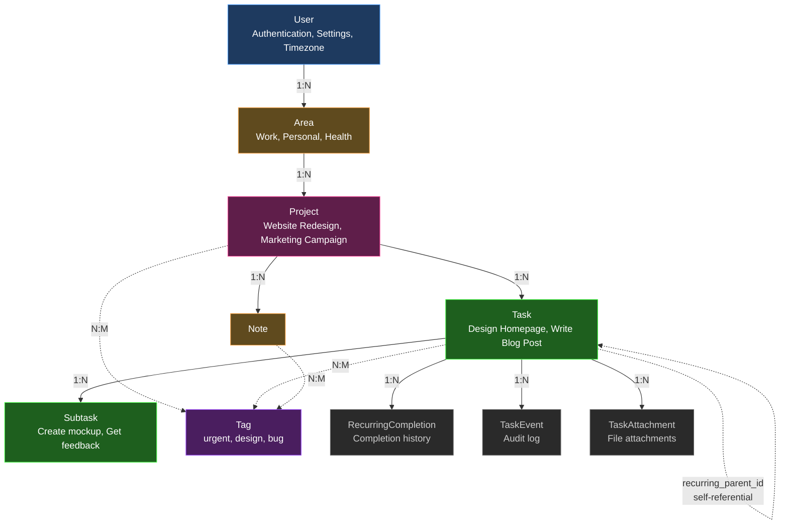

# Architecture Overview

[← Back to Index](../CLAUDE.md)

---

## Technology Stack

### Frontend Stack

- **Framework:** React 18.3.1
- **Language:** TypeScript 5.6.2
- **Build Tool:** Webpack 5 with hot module replacement
- **Styling:** Tailwind CSS 3.4.13 + Heroicons
- **State Management:** Zustand 5.0.3 (global state), SWR 2.2.5 (server state)
- **Routing:** React Router DOM 6.26.2
- **Internationalization:** i18next + react-i18next (24 languages)
- **Charts/Analytics:** Recharts 2.15.4
- **Drag & Drop:** @dnd-kit (sortable tasks)
- **Development:** webpack-dev-server with proxy configuration

### Backend Stack

- **Framework:** Express.js 4.21.2
- **ORM:** Sequelize 6.37.7
- **Database:** SQLite 5.1.7 (WAL mode, memory-mapped I/O for performance)
- **Authentication:** bcrypt + express-session + connect-session-sequelize
- **Security:** Helmet, CORS, express-rate-limit
- **API Documentation:** Swagger (swagger-jsdoc + swagger-ui-express)
- **File Upload:** Multer
- **Email:** Nodemailer 7.0.10
- **Scheduling:** node-cron 4.1.0 (for recurring tasks)
- **Date/Time:** date-fns 4.1.0 + date-fns-tz

### Testing Stack

- **Backend:** Jest + Supertest + supertest-session
- **Frontend:** Jest + React Testing Library
- **E2E:** Playwright
- **Linting:** ESLint 8 + Prettier 3.6.2

---

## Request Flow

### Development Mode



### Production Mode



---

## Data Model Hierarchy



**Relationship Key:**
- Solid lines (→) represent one-to-many (1:N) relationships
- Dotted lines (-.→) represent many-to-many (N:M) or special relationships

**Special Task Relationships:**
- `parent_task_id`: Links subtasks to parent task (self-referential)
- `recurring_parent_id`: Links recurring instances to original pattern (self-referential)

---

## Authentication & Authorization

### Dual Authentication Methods

**1. Session-Based (Primary - Web Interface)**

- Express session with Sequelize store
- HttpOnly cookies (30-day expiration)
- Session data stored in database table
- SameSite: 'lax' for CSRF protection
- Implementation: `/backend/middleware/auth.js`

**Flow:**
```
1. User logs in with email/password
2. bcrypt verifies password hash
3. Session created and stored in database
4. Session cookie sent to browser
5. Subsequent requests include cookie
6. Middleware validates session and attaches user
```

**2. Bearer Token (API Access)**

- Personal API tokens for automation/integrations
- Format: `Authorization: Bearer YOUR_TOKEN`
- Token prefix: `tt_` + 64 hex characters
- Stored as bcrypt hash in database
- Optional expiration and abilities (JSON)
- Generated via web UI: Profile > API Tokens

**Flow:**
```
1. User generates token in web interface
2. Token hash stored with prefix (first 12 chars)
3. API requests include: Authorization: Bearer tt_xxx...
4. Middleware validates token hash
5. Updates last_used_at timestamp
6. Attaches user to request
```

### Permission System

**Permission Levels:**
- `NONE` (0) - No access
- `RO` (1) - Read-only access
- `RW` (2) - Read-write access
- `ADMIN` (3) - Full administrative access

**Access Rules:**

1. **Ownership** → Automatic RW access
   - User has RW for resources they created

2. **Project Sharing** → Granted via Permission model
   - Permission record grants RO/RW/ADMIN to specific user
   - resource_type: 'project', 'task', 'note'
   - resource_uid: unique identifier

3. **Inheritance**
   - Tasks inherit access from parent Project
   - Notes inherit access from parent Project
   - Subtasks inherit access from parent Task

**Authorization Middleware:**
```javascript
// Location: /backend/middleware/authorize.js

hasAccess(requiredAccess, resourceType, getResourceUid, options)

// Usage in routes:
router.get('/task/:id',
  hasAccess('ro', 'task', (req) => req.params.id),
  async (req, res) => { ... }
);
```

---

## Core Modules Overview

### Backend Modules (19 total)

Located in `/backend/modules/`, each follows consistent architecture:

| Module | Purpose | Complexity |
|--------|---------|------------|
| **tasks** | Task management, subtasks, recurring | High - most complex module |
| **projects** | Project CRUD and organization | Medium |
| **areas** | Area categorization | Low |
| **notes** | Note-taking system | Medium |
| **tags** | Tagging system | Low |
| **users** | User management | Medium |
| **auth** | Authentication (login/register) | Medium |
| **shares** | Project sharing & permissions | High |
| **telegram** | Telegram bot integration | Medium |
| **inbox** | Quick capture inbox | Low |
| **habits** | Habit tracking | Medium |
| **notifications** | In-app notifications | Medium |
| **search** | Universal search | Medium |
| **views** | Saved custom views | Low |
| **admin** | Admin operations | Low |
| **backup** | Backup/restore functionality | High |
| **feature-flags** | Feature flag management | Low |
| **quotes** | Daily quotes | Low |
| **url** | URL handling | Low |

---

## Database Schema Highlights

**20+ Sequelize Models** in `/backend/models/`

**Core Tables:**
- **Users** - Authentication, settings, preferences
- **Areas** - Organizational categories
- **Projects** - Project grouping
- **Tasks** - Main task entity (11 indexes for performance)
- **Notes** - Project notes
- **Tags** - Flexible tagging
- **Permissions** - Sharing and access control
- **ApiTokens** - API authentication
- **RecurringCompletions** - Recurring task history
- **TaskEvents** - Audit log
- **TaskAttachments** - File uploads
- **InboxItems** - Quick capture
- **Notifications** - User notifications
- **Roles** - User role system
- **Views** - Saved custom views
- **Backups** - Backup records
- **Settings** - Application config
- **Actions** - Audit trail

**Junction Tables (Many-to-Many):**
- tasks_tags
- notes_tags
- projects_tags

**Special Fields in Tasks:**
- `recurrence_type`: daily, weekly, monthly, monthly_weekday, monthly_last_day
- `recurrence_interval`: Custom intervals (every 2 weeks, etc.)
- `parent_task_id`: Links subtasks to parent (self-referential)
- `recurring_parent_id`: Links recurring instances to original pattern

**Performance Optimizations:**
- WAL (Write-Ahead Logging) mode
- PRAGMA synchronous=NORMAL
- 64MB cache size
- 256MB memory-mapped I/O
- Memory-based temp storage
- 11 indexes on Tasks table for slow I/O systems

---

## Frontend Architecture

**Component Organization:**
- Feature-based structure in `/frontend/components/`
- Shared components in `/frontend/components/Shared/`
- Each feature has dedicated directory (Task/, Project/, Area/, etc.)

**State Management:**
- **Global State:** Zustand store (`/frontend/store/useStore.ts`)
  - Task cache
  - Project cache
  - UI state (modals, filters, selections)
- **Server State:** SWR for data fetching
  - Automatic revalidation
  - Optimistic updates
  - Cache management
- **Local State:** React useState for component-specific data

**Key Frontend Patterns:**
- Functional components with hooks (no class components)
- TypeScript interfaces in `/frontend/entities/`
- API services in `/frontend/utils/[resource]Service.ts`
- Custom hooks in `/frontend/hooks/`
- Context providers in `/frontend/contexts/`

---

[← Back to Index](../CLAUDE.md)
